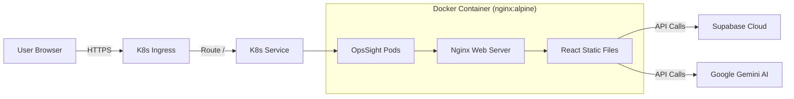

# OpsSight Deployment & Architecture Guide

## 1. Architecture Overview

OpsSight follows a modern **GitOps** architecture designed for Kubernetes.



### Components
1.  **Frontend**: React (Vite) application.
2.  **Web Server**: Nginx (Alpine Linux) serving static assets inside the container.
3.  **Container Registry**: GitHub Container Registry (GHCR).
4.  **Orchestrator**: Kubernetes (K8s).
5.  **CD Controller**: ArgoCD (optional but recommended).

---

## 2. CI/CD Pipeline

We use **GitHub Actions** for Continuous Integration and **ArgoCD** (or Helm) for Continuous Deployment.

### The Flow
1.  **Push to Main**: A developer pushes code to the `main` branch.
2.  **CI Trigger**: GitHub Action `ci-cd.yaml` starts.
3.  **Docker Build**: 
    *   Node.js installs dependencies.
    *   Vite builds the app (Secrets are injected via `build-args`).
    *   Nginx image is created with the build artifacts.
4.  **Push Registry**: The image is pushed to `ghcr.io/pavananganna90/opssight:sha-xyz`.
5.  **CD Sync**: ArgoCD detects the change (or updates `latest` tag) and syncs the Helm chart to the cluster.

---

## 3. How to Deploy

### Prerequisites
*   Docker installed locally.
*   Kubernetes Cluster (Minikube, Kind, or Cloud).
*   Helm CLI installed.

### A. Local Docker Run
To run the container locally without Kubernetes:

```bash
docker build \
  --build-arg VITE_SUPABASE_URL=your_url \
  --build-arg VITE_SUPABASE_ANON_KEY=your_key \
  --build-arg VITE_API_KEY=your_gemini_key \
  -t opssight:local .

docker run -p 8080:80 opssight:local
```
Access at `http://localhost:8080`.

### B. Helm Deployment
To deploy to a Kubernetes cluster:

1.  **Configure Secrets**:
    Ensure your GitHub repository secrets are set for the CI pipeline to work.

2.  **Install Chart**:
    ```bash
    helm upgrade --install opssight ./charts/opssight \
      --namespace opssight \
      --create-namespace
    ```

### C. ArgoCD Setup
1.  Apply the Application manifest:
    ```bash
    kubectl apply -f argocd/application.yaml
    ```
2.  ArgoCD will automatically sync the chart from the `charts/opssight` directory in your git repo.

---

## 4. How to Use OpsSight

### Login
*   **Demo Mode**: Click "Launch Home Lab Demo" on the login screen. No credentials required.
*   **Production**: Enter your email to receive a Magic Link (requires Supabase configuration).

### Features
1.  **Dashboard**: View "Real-time" metrics (simulated in Demo mode). Click "Start Sim" to see data flow.
2.  **Infrastructure**: View the topology map of your Kubernetes nodes and Pods.
3.  **Terraform**: 
    *   Go to the Terraform tab.
    *   Select a workspace.
    *   Click **Run Plan** to see a generated plan output.
    *   Click **Visual** to see the infrastructure graph.
4.  **AI Assistant**:
    *   Click the robot icon in the bottom right.
    *   Ask: *"Why is the payment-processor failing?"*
    *   Gemini will analyze the simulated logs and metrics to give you an answer.

### Troubleshooting
*   **Blank Screen?** Check the browser console. If `VITE_` env vars were missing during build, the app may fail to init.
*   **404 on Refresh?** Ensure the Nginx config includes `try_files $uri /index.html`.
